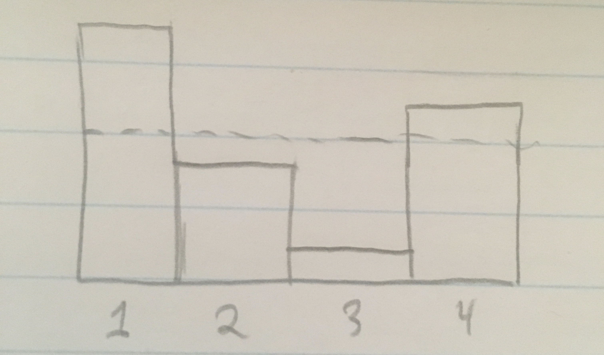
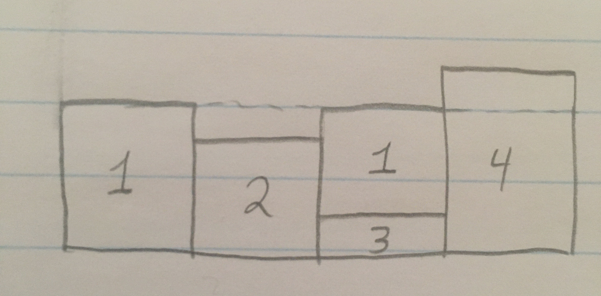
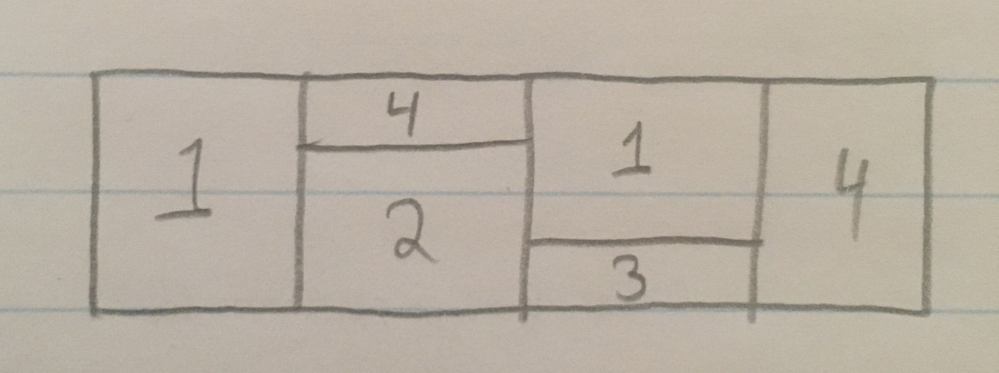

# The Fukui-Todo Algorithm

Ejaaz Merali

PIQuIL

January 22, 2021

---

## Outline

- The Fortuin-Kastelyn Representation

- The Swendsen-Wang Algorithm

- The Fukui-Todo Algorithm

- Walker's Alias Method

---

## The Fortuin-Kastelyn Representation

Consider a classical Ising Model of $N$ spins:

$$H = - \sum_{i,j} J_{ij}\sigma_i\sigma_j$$

where $\sigma_i = \pm 1$, and $J$ is a strictly upper triangular matrix. From here on, we will assume that the interactions are ferromagnetic ($J_{ij} \geq 0$).

The partition function is:

$$
\begin{aligned}
    Z &= \sum_{\mathbf{\sigma}}\left\lbrack \exp\left(\beta \sum_{i,j} J_{ij} \sigma_i \sigma_j\right)\right\rbrack \\
      &= \sum_{\mathbf{\sigma}}\left\lbrack \prod_{i,j} \exp(\beta J_{ij} \sigma_i \sigma_j)\right\rbrack \\
\end{aligned}
$$

---

We note that each factor in the product can only take one of two forms:

$$
\begin{aligned}
\exp\left(\beta J_{ij} \sigma_i \sigma_j\right) &= \left\lbrace\begin{array}{lr}
        \exp(\beta J_{ij}) &\text{if } \sigma_i = \sigma_j\\
        \exp(-\beta J_{ij}) &\text{otherwise}\\
      \end{array}\right\rbrace \\
      &= \exp(\beta J_{ij})\left\lbrack\exp(-2\beta J_{ij}) + (1 - \exp(-2\beta J_{ij}))\delta_{\sigma_i\sigma_j}\right\rbrack \\
\end{aligned}
$$

Let $p_{ij} = 1 - \exp(-2\beta J_{ij})$, the partition function is then:

$$
Z = \sum_{\mathbf{\sigma}}\left\lbrack \prod_{i,j}  \exp(\beta J_{ij})\left\lbrack(1 - p_{ij}) + p_{ij}\delta_{\sigma_i\sigma_j}\right\rbrack\right\rbrack
$$

Next we introduct binary "bond" variables $b_{ij} = 0, 1$ which indicate whether
the spins are aligned or not:

$$
Z = \sum_{\mathbf{\sigma}} \prod_{i,j} \sum_{b_{ij}} \exp(\beta J_{ij})\left\lbrack(1 - p_{ij})\delta_{b_{ij}, 0} + p_{ij}\delta_{\sigma_i\sigma_j}\delta_{b_{ij},1}\right\rbrack
$$

---

## The Swendsen-Wang Algorithm

The Swendsen-Wang algorithm is a cluster update algorithm based on the Fortuin-Kastelyn representation of the partition function. The update procedure is:

1. For all pairs of spins $(\sigma_i, \sigma_j)$, set $b_{ij} = 1$ with probability
   $P_{ij} = p_{ij} \delta_{\sigma_i\sigma_j}$. This is usually done by first checking whether the spins are aligned, and then setting $b_{ij} = 1$ with probability $p_{ij} = 1 - \exp(-2\beta J_{ij})$.
2. Inspect $\lbrace b_{ij}\rbrace$ to identify clusters of spins
3. Flip clusters independently with probability $\frac{1}{2}$.

In the case of nearest-neighbor interactions, each Monte-Carlo step takes $O(N)$ time, where $N$ is the number of spins. However, in the case of long-range interactions, the first part would end up taking $O(N^2)$ time.

---

- In 1995, Luijten and Bl&ouml;te proposed an alternative to step 1. which brought the run-time down to $O(N\log N)$ for interactions which decayed quickly enough as a function of distance
  - Made use of the fact that we could propose a candidate bond *first* and then check whether the spins were aligned before activating the bond
  - The total number of candidate bonds is a random variable with expectation that scales as $O(N)$
  - Defined a distribution over the bonds which would require $O(N^4)$ memory, but used some transformations to bring this down to $O(N^2)$

---

- Sampled these discrete distributions by first constructing the cumulative distribution, $F_i = \sum_{j=1}^i p_j$
  - drawing a uniform variable $u \sim U[0, 1]$
  - finding $m$ such that $F_{m-1} \leq u \lt F_m$

- Naively, we'd start $m$ at 1 and keep incrementing it until we found the correct one
  - would take $O(N^2)$ time, very slow!
- Using binary search to draw samples gives $O(\log N)$ time for each sample

---

## The Fukui-Todo Algorithm

- In 2008, Fukui and Todo noted that binary search was not the optimal method for sampling from a discrete distribution
  - Walker's Alias Method allows us to draw samples in constant time
- However, due to the transformation used in the Luijten-Bl&ouml;te algorithm to reduce its memory usage, the Alias Method could not be directly applied
- Need an alternative way to sample from the distribution of bonds

---

Begin by extending the Fortuin-Kastelyn representation

Replace the binary bond variables $b_{ij} = 0,1$ with $k_{ij} = 0,1,2,\ldots$

The new bond variable $k_{ij}$ must follow a Poisson distribution with mean $\lambda_{ij} = 2\beta J_{ij}$

This yields the extended Fortuin-Kastelyn representation of the partition function:
$$
Z = \sum_{\mathbf{\sigma}} \prod_{i,j} \sum_{k_{ij}=0}^\infty
\frac{\exp(-\beta J_{ij})}{k_{ij}!}(2\beta J_{ij})^{k_{ij}}
\left( \delta_{k_{ij},0} + (1 - \delta_{k_{ij}, 0})\delta_{\sigma_i,\sigma_j}\right)
$$

---

- Generating a Poisson RV for each bond gives an alternative, but equivalent, method of activating bonds between parallel spins.

- Caveat: lot of overhead in sampling a Poisson RV separately for each bond

- Solution: use properties of the Poisson distribution to combine all bond variables into just one Poisson RV

---

Consider the joint probability of $N_b$ bond variables $k_l$ where $l$ is the bond index:

$$
\prod_{l=1}^{N_b} f(k_l; \lambda_l)
= f(k_t; \lambda_t) \left\lbrack(k_t!) \prod_{l=1}^{N_b} \frac{1}{k_l!}\left(\frac{\lambda_l}{\lambda_t}\right)^{k_l}\right\rbrack
$$

where $f(k; \lambda)$ is the PDF of $\text{Poisson}(\lambda)$, $\lambda_t = \sum_l \lambda_l = 2\beta\sum_l J_l$ and $k_t = \sum_l k_l$.

RHS of the above expression is the probability of sampling the Poisson random variable $k_t$ with mean $\lambda_t$ times the probability of sampling $\{k_l\}_l$ from a multinomial distribution with $k_t$ trials and category probabilities given by $\{\lambda_l/\lambda_t\}_l$.

---

We can now propose an alternative bond activation step to the Swendsen-Wang procedure:

1. Initialize all bonds $k_{ij} = 0$

2. Draw $k_t \sim \text{Poisson}(\lambda_t)$

3. Repeat $k_t$ times:
   1. Sample a bond $l = (i, j)$ from $p_l = \lambda_l/\lambda_t = J_l / \sum_l J_l$.
   2. If $\sigma_i = \sigma_j$, increment $k_{ij}$ by one.

Step 3.i. is the bottleneck of this algorithm. Using a naive binary search to sample a bond (as in the Luijten-Bl&ouml;te algorithm), will give a time complexity of $O(\log N)$ for each sampled bond. Using Walker's Alias Method, we can bring this down to $O(1)$.

---

### Aside

The extended Fortuin-Kastelyn representation allows us to derive new estimators for certain quantities, such as the energy and specific heat:

$$E = \sum_{ij} J_{ij} - \frac{1}{\beta}\left\langle \sum_{ij}k_{ij}\right\rangle_{MC}$$

$$
C = \frac{1}{N}\left\lbrack
\left\langle \left(\sum_{ij} k_{ij}\right)^2\right\rangle_{MC}
- \left\langle \sum_{ij} k_{ij}\right\rangle_{MC}^2
- \left\langle \sum_{ij} k_{ij}\right\rangle_{MC}
\right\rbrack
$$

An interesting feature of these estimators is that one does not need to iterate over all bonds, just the ones that are active at each MC step, which reduces the runtime from $O(N_b)$ to $O(N)$ for quickly decaying interactions. Note: in the expectations above, $k_{ij}$ have been coupled with the spin variables, so we can't treat them as Poisson RVs and evaluate the expectations analytically.

---

## Walker's Alias Method

- Given a probability distribution with $M$ events, $p_i$
- Define $M$ bins with height equal to 1
- Assign each bin a cut-off probability $c_i \in [0,1]$, and an "alias"
  $$a_i \in \{1,2,\ldots,M\}$$

To sample from such a structure, we generate 2 uniform random variables:
$$i \sim U\{1,2,\ldots,M\} \qquad u \sim U[0, 1]$$

If $u < c_i$, we return $i$, otherwise we return $a_i$.

---

- The alias table is not unique (this can be seen by parameter counting)
- Walker (1977) gave an initialization scheme which took $O(M^2)$ time
  - could have easily been reduced to $O(M\log M)$ had he used a better intermediate data structure
- Vose (1991) gave a simple method to construct the alias table in $O(M)$ time.
- Oftentimes the distribution is only initialized once, but is used to generate many samples
  - Initialization run-time may not be very important

---

### How to build an alias table

Basic Idea:

- Compute the "average probability" (i.e. $1/M$)
- Pick one bin that is "over-filled" ($p_i > 1/M$) and one that is "under-filled" ($p_j < 1/M$)
  - if an over-filled bin exists, there *must* be an under-filled bin
- Take as much probability mass from the over-filled bin, $i$, as necessary is to "fill" the underfull bin, $j$
  - set alias of $j$ to $i$, and cut-off of bin $j$ to be it's probability mass before the weight transfer
- The over-filled bin may now be under-filled (that's ok!)
- The under-filled bin should now be exactly filled
- Repeat until all bins are exactly filled

---

---

---

---

## References

R. H. Swendsen and J. S. Wang, Phys. Rev. Lett. 58, 86 (1987)

E. Luijten and H. W. Blöte, Int. J. Mod. Phys. C 6, 359 (1995)

K. Fukui and S. Todo, J. Comp. Phys. 228, 2629 (2009)

A. J. Walker, ACM Trans. Math. Software 3 (1977)

M. D. Vose, IEEE Transactions on software engineering (1991)

K. Shwarz, "Darts, Dice, and Coins: Sampling from a Discrete Distribution", keithschwarz.com (2011)
